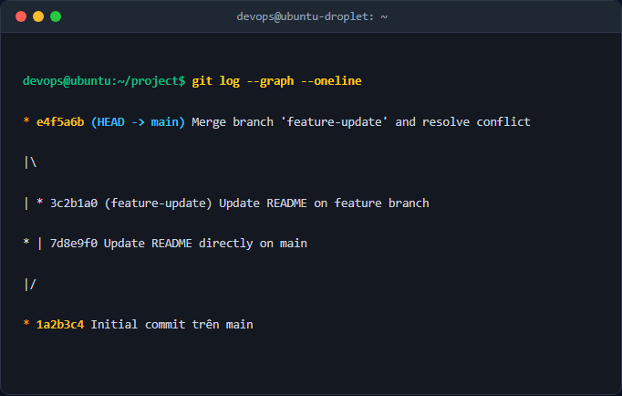

# Báo cáo kỹ thuật: Quản lý nhánh và Giải quyết xung đột (Merge Conflict)

## 1. Mục tiêu & Bối cảnh kỹ thuật
Tóm tắt yêu cầu và môi trường thực hiện:
- Quản lý nhánh và di chuyển linh hoạt giữa các nhánh cục bộ.
- Cố ý tạo ra xung đột gộp nhánh (Merge Conflict) trên file `README.md` khi nhánh `main` và nhánh phụ `feature-update` cùng chỉnh sửa một dòng mã nguồn.
- Thực hiện xử lý xung đột thủ công, hiểu rõ cơ chế 3-Way Merge và hoàn thành commit gộp nhánh.

## 2. Các bước thực hiện chi tiết
- Khởi tạo repository Git:
  `git init`
- Tạo commit ban đầu trên nhánh `main`:
  `echo "# Dự án DevOps" > README.md`
  `git add README.md`
  `git commit -m "Initial commit trên main"`
- Tạo và chuyển sang nhánh phụ `feature-update`:
  `git checkout -b feature-update`
- Thay đổi nội dung file `README.md` trên nhánh `feature-update`:
  `echo "Tính năng mới được phát triển tại đây" >> README.md`
  `git add README.md`
  `git commit -m "Update README on feature branch"`
- Chuyển lại nhánh `main` và tạo xung đột bằng cách thay đổi cùng một dòng:
  `git checkout main`
  `echo "Cập nhật trực tiếp trên nhánh chính main" >> README.md`
  `git add README.md`
  `git commit -m "Update README directly on main"`
- Gộp nhánh `feature-update` vào `main` để tạo xung đột:
  `git merge feature-update`
- Sửa file `README.md` thủ công để xóa các ký hiệu `<<<<<<<`, `=======`, `>>>>>>>` và giữ lại nội dung hợp lệ.
- Hoàn thành quá trình gộp nhánh:
  `git add README.md`
  `git commit -m "Merge branch feature-update and resolve conflict"`

## 3. Kiểm tra & Xác thực kết quả
Lệnh kiểm tra lịch sử commit:
`git log --graph --oneline`

## 4. Kết luận & Best Practices bảo mật vận hành
- Luôn cập nhật nhánh cục bộ trước khi tạo pull request hoặc merge.
- Kiểm tra kỹ các dòng conflict thủ công để tránh ghi đè mã nguồn quan trọng.
- Sử dụng công cụ trực quan hóa (như Git graph) để theo dõi luồng phát triển.